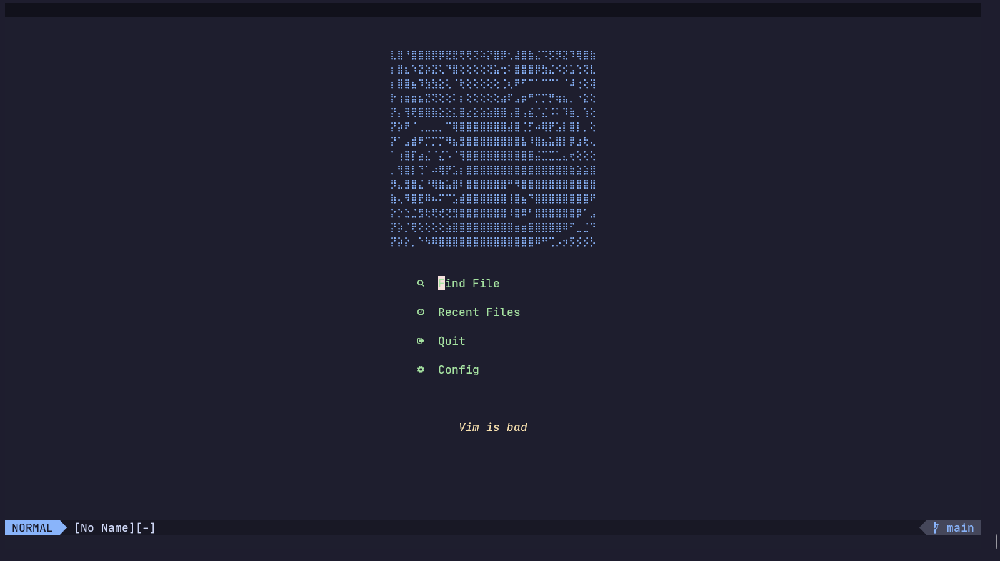
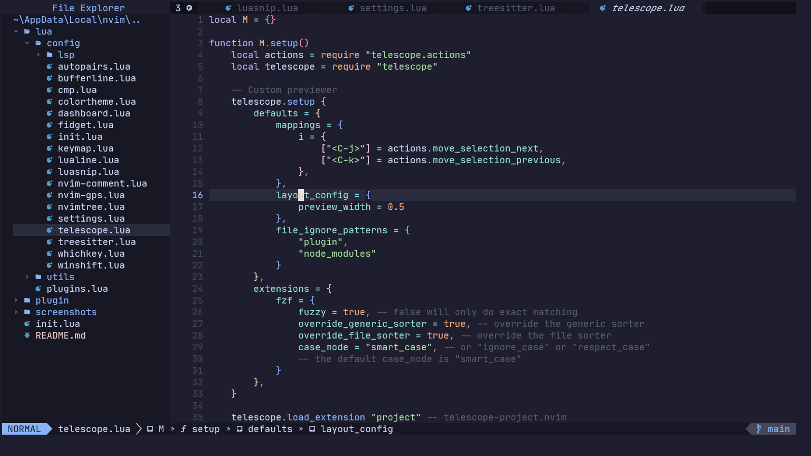
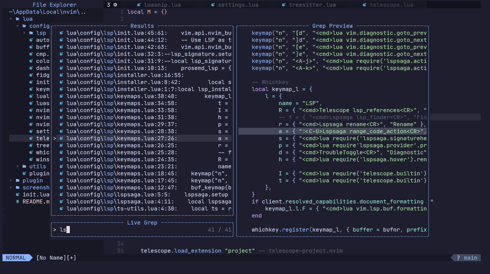

# It has  support only Linux and Windows.
# Tested Only On Windows

## Install [package manager](https://github.com/wbthomason/packer.nvim):

**Windows:**

```sh
git clone https://github.com/wbthomason/packer.nvim "$env:LOCALAPPDATA\nvim-data\site\pack\packer\start\packer.nvim"
```

**Linux/Mac:**

```sh
git clone --depth 1 https://github.com/wbthomason/packer.nvim\
 ~/.local/share/nvim/site/pack/packer/start/packer.nvim
```
---

## Install Config:

**Windows:**

```sh
git clone https://github.com/Timm-png/neovim-dotfiles/ ~\AppData\Local\nvim
```

**Linux:**

```sh
git clone https://github.com/Timm-png/neovim-dotfiles/ ~/.config/nvim
```

---

### Screenshots






---

#### Other plugins I'm lazy to add

https://github.com/LunarVim/Neovim-from-scratch

https://github.com/williamboman/nvim-lsp-installer

https://github.com/neovim/nvim-lspconfig

https://github.com/onsails/lspkind.nvim

https://github.com/tami5/lspsaga.nvim

https://github.com/hrsh7th/cmp-git

https://github.com/hrsh7th/cmp-nvim-lsp

https://github.com/hrsh7th/nvim-kit

https://github.com/folke/trouble.nvim

https://gitlab.com/yorickpeterse/nvim-window

https://github.com/lukas-reineke/lsp-format.nvim

https://github.com/windwp/nvim-autopairs

https://github.com/nvim-telescope/telescope.nvim

https://github.com/rstacruz/vim-closer

https://github.com/andymass/vim-matchup

https://github.com/lewis6991/gitsigns.nvim

https://github.com/mfussenegger/nvim-dap

https://github.com/rcarriga/nvim-dap-ui
