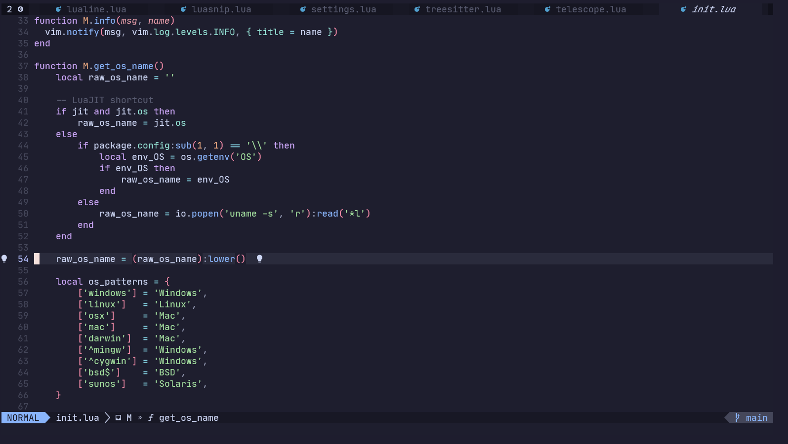

# It has  support only Linux and Windows.
# Tested Only On Windows

## Install [package manager](https://github.com/wbthomason/packer.nvim):

**Windows:**

```sh
git clone https://github.com/wbthomason/packer.nvim "$env:LOCALAPPDATA\nvim-data\site\pack\packer\start\packer.nvim"
```

**Linux/Mac:**

```sh
git clone --depth 1 https://github.com/wbthomason/packer.nvim\
 ~/.local/share/nvim/site/pack/packer/start/packer.nvim
```
---

## Install [pipgrep](https://github.com/BurntSushi/ripgrep) (requirement for text search)

**Windows:**
```sh 
scoop install ripgrep
```

**Linux:**
```sh
# Debian/Ubuntu
sudo apt-get install ripgre

# Fedora
sudo dnf install ripgrep

# Arch Linux
sudo pacman -S ripgrep
```

**MacOS:**
```sh
brew install ripgrep
```

---

## Install gcc and make (requirement for fzf)

**Windows:**
```sh 
scoop install gcc make
```

**Linux:**
```sh
# Debian/Ubuntu
sudo apt install build-essential

# Fedora
sudo dnf install gcc make

# Arch Linux
sudo pacman -S gcc make
```

**MacOS:**
```sh
brew install gcc make
```

---
## Install Config:

**Windows:**

```sh
git clone https://github.com/Timm-png/neovim-dotfiles/ ~\AppData\Local\nvim
```

**Linux:**

```sh
git clone https://github.com/Timm-png/neovim-dotfiles/ ~/.config/nvim
```

---

### Screenshots




---

#### Other plugins I'm lazy to add

https://alpha2phi.medium.com/learn-neovim-the-practical-way-8818fcf4830f

https://github.com/nvim-telescope/telescope.nvim/wiki/Extensions

https://github.com/LunarVim/Neovim-from-scratch

https://github.com/lewis6991/gitsigns.nvim

https://github.com/mfussenegger/nvim-dap

https://github.com/rcarriga/nvim-dap-ui

https://github.com/nvim-telescope/telescope-dap.nvim

https://github.com/nvim-telescope/telescope-project.nvim

https://github.com/AckslD/nvim-neoclip.lua

https://github.com/phaazon/hop.nvim

https://github.com/rcarriga/nvim-notify
